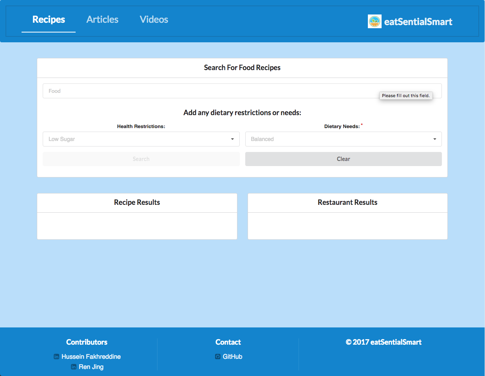

# eatSentialSmartReact

* Eat Healthier and Smarter!

## Description

This is an MVC Architectural Pattern application using the React Framework. It implements the Edamam API, Zomato API, NY Times API, and YouTube API to get and display data.

* The user can search for recipes based on dietary needs and health restrictions and also displays local restaurants that serve those foods. 
* The user can search for food articles. 
* The user can search for How To YouTube videos.

##### Demo: https://eatsentialsmart.herokuapp.com/

